<p align="center">
  <a href="https://cdth.ca"></a>
</p>

<h1 align="center">CDTH Data Kit</h1>

<p align="center">
  <b>Practice data, starter notebooks and open datasets for Canada's Defence Tech Hackathon.</b><br>
  November 14–15, 2026 · Edmonton and online across Canada
</p>

<p align="center">
  <a href="https://cdth.ca"></a>
  
  
  <a href="LICENSES.md"></a>
</p>

<p align="center">
  <a href="#quickstart">Quick start</a> ·
  <a href="#challenges">Challenges</a> ·
  <a href="#scoring">Scoring</a> ·
  <a href="CATALOG.md">Dataset catalogue</a> ·
  <a href="reference/README.md">Reference layers</a> ·
  <a href="#licence">Licence</a>
</p>

<br>

<p align="center">
  
</p>

<p align="center"><i>Something real to build on from the first hour.</i></p>

<table>
<tr>
<td width="25%" valign="top" align="center">
<h3>🎯</h3>
<b>Practice challenges</b><br>
<sub>Ready-to-use data, training labels and a scoring script for each theme. Hidden test windows keep results fair.</sub>
</td>
<td width="25%" valign="top" align="center">
<h3>📓</h3>
<b>Starter notebooks</b><br>
<sub>Load, map, baseline, score and write a valid submission. Top to bottom in under a minute.</sub>
</td>
<td width="25%" valign="top" align="center">
<h3>🗺️</h3>
<b>Reference layers</b><br>
<sub>Airports, runways, navaids, power plants, communities, ports, roads, provinces and wildfires.</sub>
</td>
<td width="25%" valign="top" align="center">
<h3>📚</h3>
<b>Dataset catalogue</b><br>
<sub>69 real public datasets, each checked on 2026-10-04 with link, licence and access notes.</sub>
</td>
</tr>
</table>

> [!IMPORTANT]
> **Practice data is synthetic.** The challenge scenarios are fictional and made by computer. The ships, drones, jammers, fires and weather are not real, and no file contains classified, sensitive or personal information. Real geography is used where noted: places, roads, aerodromes and fuel types. Do not treat anything in `challenges/` as a description of real events, real capabilities or real vulnerabilities.

<a id="quickstart"></a>
<br>
<p align="center"></p>

```bash
git clone https://github.com/mholovetskyi/cdth.git && cd cdth
python -m pip install -r requirements.txt
cd challenges/01_arctic_watch
jupyter lab starter.ipynb          # or open it in VS Code / Colab
```

Every starter notebook runs top to bottom in **under a minute** on a laptop.

<a id="challenges"></a>
<br>
<p align="center"></p>

<p align="center">
<a href="challenges/01_arctic_watch"></a>
<a href="challenges/02_eyes_on_the_sky"></a>
<a href="challenges/03_stay_connected"></a>
<a href="challenges/04_ready_and_resilient"></a>
</p>

Each challenge folder has its own `README.md` datasheet with file schemas, task definitions, metrics, submission formats and baseline scores.

<a id="scoring"></a>
<br>
<p align="center"></p>

**Challenges 01–03** release labels for the first days (`labels_train/`) and keep the last days hidden.
1. Make your own validation slice from `labels_train/`, for example the last training day.
2. Score it with the challenge's `score.py`. The organizers run the same script on the hidden days.

**Challenge 04** has two scenarios.
- `scenario_practice` comes with its full truth, so you can see exactly what happened after the decision time.
- `scenario_eval` stops at the decision time, and the organizers hold its truth.

All scripts need only standard Python data tools and print a JSON summary. Run `python score.py --help` in any challenge folder.

> [!NOTE]
> Hidden-test answer keys are not in this repository. Organizers hold them separately.

<a id="data"></a>
<br>
<p align="center"></p>

### 📁 Folder layout

```
.
├── README.md                 this file
├── LICENSES.md               sources, licences and required attributions
├── CATALOG.md                69 real public datasets by theme (also catalog.csv)
├── requirements.txt
├── reference/                real open data layers for Canada (see reference/README.md)
└── challenges/
    ├── 01_arctic_watch/          data, labels_train/, starter.ipynb, score.py, README.md
    ├── 02_eyes_on_the_sky/       ...
    ├── 03_stay_connected/        ...
    └── 04_ready_and_resilient/   common/, scenario_practice/ (with truth/), scenario_eval/, ...
```

### 🌐 Time and coordinates

| | |
|---|---|
| **Timestamps** | ISO 8601 UTC (`...Z`). Alberta local time is UTC−6 in the challenge periods (Mountain Daylight Time). |
| **Coordinates** | WGS84 latitude and longitude in decimal degrees. |
| **Rasters (04)** | EPSG:3978, NAD83 / Canada Atlas Lambert. In this region grid north is 15–20° off true north, while wind directions are given relative to true north. |

### 💡 Using the data well

- **Keep to the decision time.** In challenge 04, only use information available at the decision time in your eval run. Each notebook includes a helper for this.
- **Simple labels.** The labels are simple on purpose. Several tasks have a strong simple baseline, so the interesting work is often in speed, explanation, fusion, interfaces and robustness rather than a slightly higher F1. Each datasheet lists harder variants.
- **Real data for the weekend.** If you build on real data during the event, [`CATALOG.md`](CATALOG.md) lists sources with licences and access notes. Check the licence before you ship anything commercial.

<a id="licence"></a>
<br>
<p align="center"></p>

- **Code** (starter notebooks, `score.py` scripts): MIT, see [`LICENSE`](LICENSE).
- **Synthetic practice data** in `challenges/`: free to use during and after the event. Keep the "synthetic" notice when you share it.
- **Real reference data** in `reference/` and challenge 04: each source keeps its own open licence (public domain, CC BY 4.0, OGL-Canada). Required attributions are in [`LICENSES.md`](LICENSES.md).
- **Catalogued datasets** in [`CATALOG.md`](CATALOG.md) are not redistributed here; check each one's licence.

### ✉️ Questions

Contact the organizers through [cdth.ca](https://cdth.ca). When you report a data problem, include the file name and the row.

---

<p align="center">
  <br>
  <sub>Canada's Defence Tech Hackathon · Edmonton + Online · 53.54°N 113.49°W</sub>
</p>
